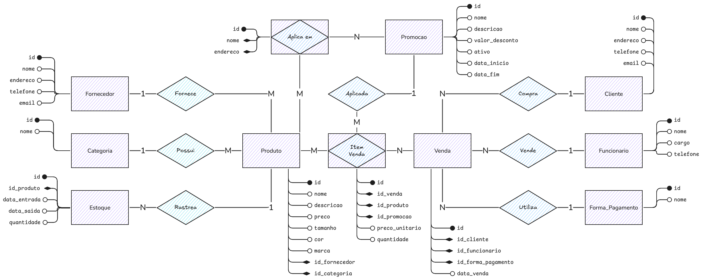
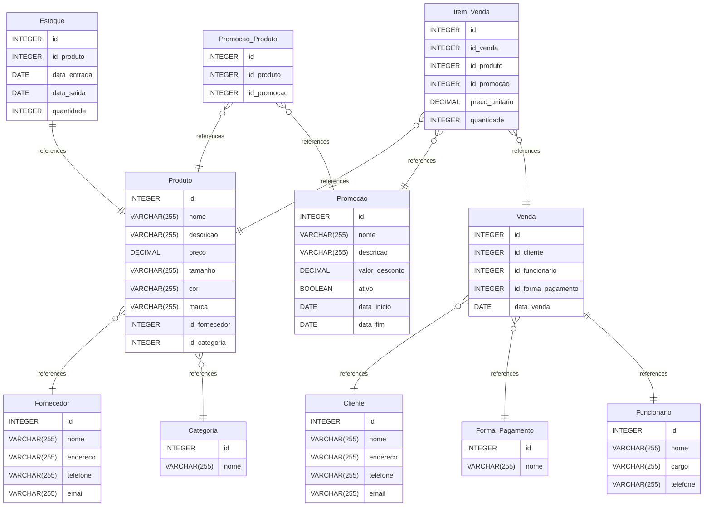

# Loja de Roupas

Este banco de dados foi projetado para gerenciar as operações de uma loja de roupas,
incluindo produtos, vendas, clientes, estoque e promoções.

## Estrutura do Banco de Dados

O banco de dados Loja_de_Roupas contém as seguintes tabelas:

### Cadastros

1. Fornecedor

   - Cadastro de fornecedores dos produtos

2. Categoria

   - Categorias de produtos (ex: masculino, feminino, infantil)

3. Cliente

   - Cadastro de clientes da loja

4. Forma_Pagamento

   - Métodos de pagamento aceitos (ex: cartão, dinheiro, pix)

5. Funcionario

   - Cadastro de funcionários da loja

### Produtos

1. Produto

   - Armazena informações sobre os produtos da loja (nome, descrição, preço,
     tamanho, cor, marca)
   - Relacionado com Fornecedor e Categoria

2. Estoque

   - Controla o fluxo de entrada e saída de produtos no estoque
   - Relacionado com Produto

### Vendas

1. Item_Venda

   - Registra os itens individuais de cada venda
   - Relacionado com Venda, Produto e Promoção

2. Venda

   - Contém os dados das transações de venda
   - Relacionado com Cliente, Funcionário e Forma de Pagamento

### Promocoes

1. Promocao

   - Armazena informações sobre promoções ativas e históricas

2. Promocao_Produto

   - Tabela de relacionamento entre produtos e promoções

### Relacionamentos

O banco possui os seguintes relacionamentos principais:

    Produto → Fornecedor (muitos-para-um)

    Produto → Categoria (muitos-para-um)

    Item_Venda → Venda (muitos-para-um)

    Item_Venda → Produto (muitos-para-um)

    Venda → Cliente (muitos-para-um)

    Venda → Funcionário (muitos-para-um)

    Estoque → Produto (muitos-para-um)

Todos os relacionamentos utilizam ON UPDATE CASCADE ON DELETE CASCADE para manter
a integridade referencial.

## MER

Modelo Entidade Relacionamento

## MR

Modelo Relacional

[MR](https://www.drawdb.app/editor?shareId=a9c45cac64125718fb8696042fcb4a9c)

