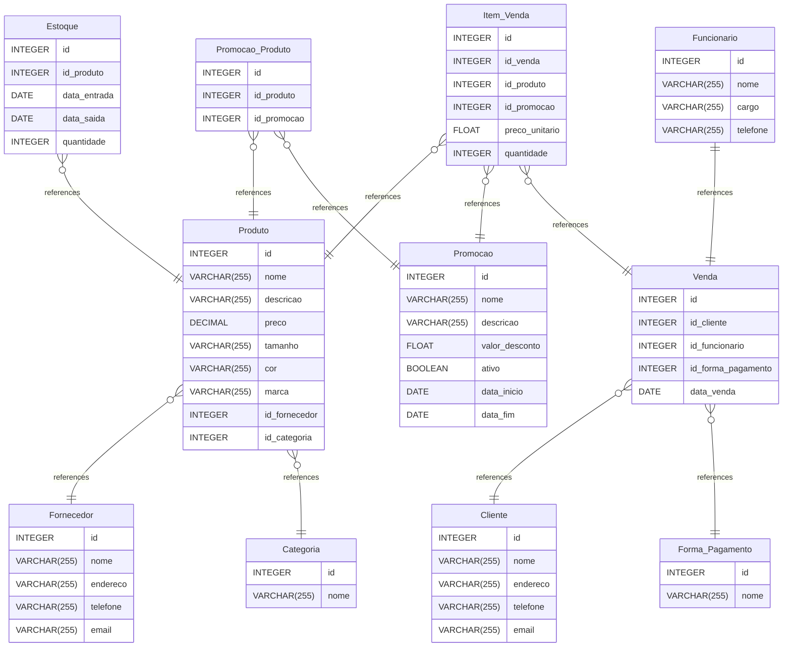

# Loja de Roupas

Uma loja de roupas requer um banco de dados bem projetado para gerenciar eficientemente
seu estoque, clientes, vendas e fornecedores. Abaixo, descrevemos os principais elementos
deste minimundo:

## Entidades

### Produtos

- A loja possui diversos produtos, que incluem roupas, acessórios e calçados.
- Cada produto é identificado por um código único e possui informações como
  nome, descrição, preço, tamanho, cor e marca.

### Categorias de Produtos

- Os produtos podem ser categorizados em tipos diferentes, como roupas femininas,
  masculinas, infantis, acessórios, etc.
- Cada categoria tem um nome e pode conter vários produtos.

### Estoque

- O estoque da loja armazena informações sobre a quantidade disponível de cada
  produto.
- É importante rastrear a quantidade em estoque, bem como as datas de entrada
  e saída de produtos.

### Fornecedores

- A loja compra produtos de diversos fornecedores.
- Cada fornecedor é registrado com informações como nome, endereço, número
  de telefone e email.

### Clientes

- Os clientes são fundamentais para a loja.
- Cada cliente possui um perfil com informações pessoais, como nome, endereço,
  número de telefone e email.

### Vendas

- As vendas representam transações de produtos entre a loja e os clientes.
- Cada venda inclui detalhes como a data da venda, o cliente envolvido e os produtos
  comprados.
- É necessário registrar informações sobre descontos, formas de pagamento e
  status da entrega.

### Funcionários

- A loja pode ter funcionários que ajudam na operação diária.
- Cada funcionário possui informações pessoais, como nome, identificação,
  cargo e contato.

### Promoções e Descontos

- Para atrair clientes, a loja pode realizar promoções e oferecer descontos em
  produtos específicos ou durante determinados períodos.

---

Este sistema de banco de dados oferece suporte para gerenciar efetivamente todas
as operações de uma loja de roupas, desde o acompanhamento do estoque até o atendimento
ao cliente e o registro de vendas.

Ele ajuda a melhorar a eficiência e a tomada de decisões da loja, garantindo que
os produtos certos estejam disponíveis para os clientes no momento certo.

## MR

[MR](https://www.drawdb.app/editor?shareId=a9c45cac64125718fb8696042fcb4a9c)

