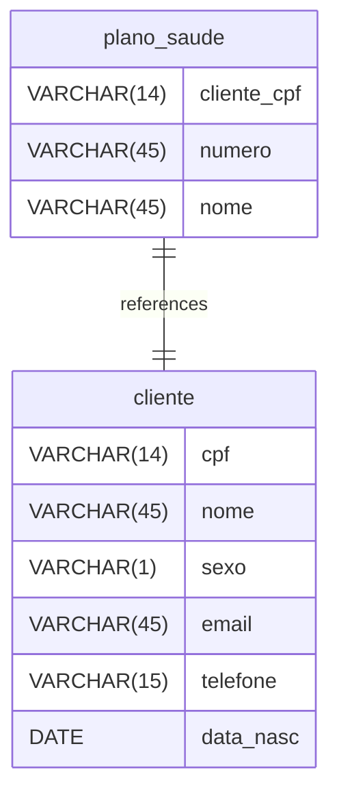

# FarmaciaADS039 documentation

## Summary

- [Introduction](#introduction)
- [Database Type](#database-type)
- [Table Structure](#table-structure)
  - [cliente](#cliente)
  - [plano_saude](#plano_saude)
- [Relationships](#relationships)
- [Database Diagram](#database-diagram)

## Introduction

## Database type

- **Database system:** SQLite

## Table structure

### cliente

| Name          | Type        | Settings                 | References | Note |
| ------------- | ----------- | ------------------------ | ---------- | ---- |
| **cpf**       | VARCHAR(14) | 🔑 PK, not null , unique |            |      |
| **nome**      | VARCHAR(45) | not null                 |            |      |
| **sexo**      | VARCHAR(1)  | not null                 |            |      |
| **email**     | VARCHAR(45) | not null                 |            |      |
| **telefone**  | VARCHAR(15) | not null                 |            |      |
| **data_nasc** | DATE        | not null                 |            |      |

### plano_saude

| Name            | Type        | Settings                 | References                         | Note |
| --------------- | ----------- | ------------------------ | ---------------------------------- | ---- |
| **cliente_cpf** | VARCHAR(14) | 🔑 PK, not null , unique | fk_plano_saude_cliente_cpf_cliente |      |
| **numero**      | VARCHAR(45) | not null                 |                                    |      |
| **nome**        | VARCHAR(45) | not null                 |                                    |      |

#### Indexes

| Name                | Unique | Fields      |
| ------------------- | ------ | ----------- |
| plano_saude_index_0 |        | cliente_cpf |

## Relationships

- **plano_saude to cliente**: one_to_one

## Database Diagram

