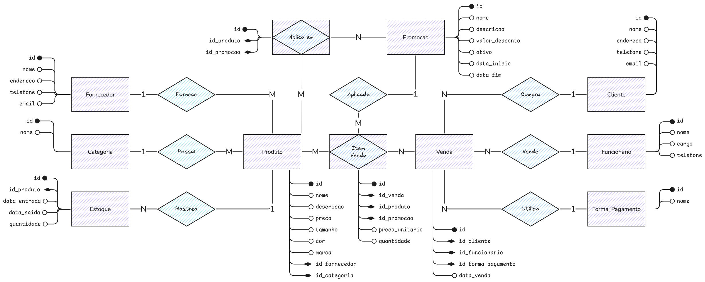
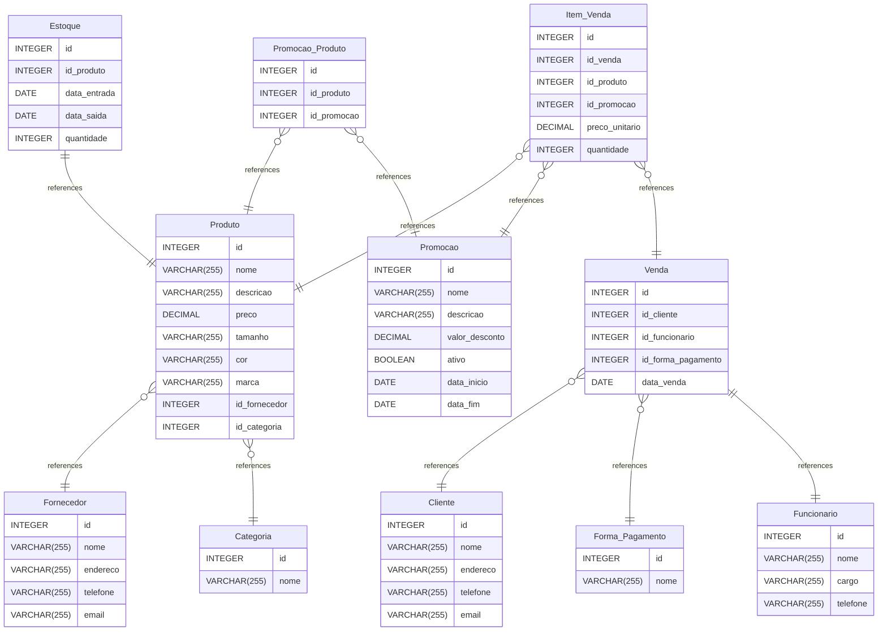

<!-- markdownlint-disable MD046 -->
<!-- markdownlint-disable MD029 -->

# Loja de Roupas

Este banco de dados foi projetado para gerenciar as operações de uma loja de roupas,
incluindo produtos, vendas, clientes, estoque e promoções.

## Estrutura do Banco de Dados

O banco de dados Loja_de_Roupas contém as seguintes tabelas:

### Cadastros

1. Fornecedor

   - Cadastro de fornecedores dos produtos

2. Categoria

   - Categorias de produtos (ex: masculino, feminino, infantil)

3. Cliente

   - Cadastro de clientes da loja

4. Forma_Pagamento

   - Métodos de pagamento aceitos (ex: cartão, dinheiro, pix)

5. Funcionario

   - Cadastro de funcionários da loja

### Produtos

1. Produto

   - Armazena informações sobre os produtos da loja (nome, descrição, preço,
     tamanho, cor, marca)
   - Relacionado com Fornecedor e Categoria

2. Estoque

   - Controla o fluxo de entrada e saída de produtos no estoque
   - Relacionado com Produto

### Vendas

1. Item_Venda

   - Registra os itens individuais de cada venda
   - Relacionado com Venda, Produto e Promoção

2. Venda

   - Contém os dados das transações de venda
   - Relacionado com Cliente, Funcionário e Forma de Pagamento

### Promocoes

1. Promocao

   - Armazena informações sobre promoções ativas e históricas

2. Promocao_Produto

   - Tabela de relacionamento entre produtos e promoções

### Relacionamentos

O banco possui os seguintes relacionamentos principais:

    Produto → Fornecedor (muitos-para-um)

    Produto → Categoria (muitos-para-um)

    Item_Venda → Venda (muitos-para-um)

    Item_Venda → Produto (muitos-para-um)

    Venda → Cliente (muitos-para-um)

    Venda → Funcionário (muitos-para-um)

    Estoque → Produto (muitos-para-um)

Todos os relacionamentos utilizam ON UPDATE CASCADE ON DELETE CASCADE para manter
a integridade referencial.

## MER

Modelo Entidade Relacionamento



## MR

Modelo Relacional

[MR](https://www.drawdb.app/editor?shareId=a9c45cac64125718fb8696042fcb4a9c)



## Relatorios

1. Produtos com estoque baixo e seus fornecedores

```sql
SELECT p.nome, p.marca, e.quantidade, f.nome AS fornecedor, f.telefone
FROM Produto p
JOIN Estoque e ON p.id = e.id_produto
JOIN Fornecedor f ON p.id_fornecedor = f.id
WHERE e.quantidade < 20
ORDER BY e.quantidade;
```

2. Vendas realizadas por um funcionário específico com detalhes

```sql
SELECT v.id, v.data_venda, c.nome AS cliente,
       SUM(iv.quantidade * iv.preco_unitario) AS total_venda
FROM Venda v
JOIN Funcionario f ON v.id_funcionario = f.id
JOIN Cliente c ON v.id_cliente = c.id
JOIN Item_Venda iv ON v.id = iv.id_venda
WHERE f.nome = 'Roberto Sales'
GROUP BY v.id, v.data_venda, c.nome
ORDER BY v.data_venda DESC;
```

3. Produtos que nunca foram vendidos (usando SUBSELECT)

```sql
SELECT p.id, p.nome, p.marca, p.preco
FROM Produto p
WHERE p.id NOT IN (
    SELECT DISTINCT id_produto
    FROM Item_Venda
);
```

4. Clientes que mais gastaram (top 10)

```sql
SELECT c.id, c.nome,
       SUM(iv.quantidade * iv.preco_unitario) AS total_gasto,
       COUNT(DISTINCT v.id) AS qtd_compras
FROM Cliente c
JOIN Venda v ON c.id = v.id_cliente
JOIN Item_Venda iv ON v.id = iv.id_venda
GROUP BY c.id, c.nome
ORDER BY total_gasto DESC
LIMIT 10;
```

5. Promoções ativas com produtos participantes

```sql
SELECT pr.nome AS promocao, pr.valor_desconto,
       p.nome AS produto, p.preco,
       (p.preco * (1 - pr.valor_desconto/100)) AS preco_promocional
FROM Promocao pr
JOIN Promocao_Produto pp ON pr.id = pp.id_promocao
JOIN Produto p ON pp.id_produto = p.id
WHERE pr.ativo = 1
AND CURRENT_DATE BETWEEN pr.data_inicio AND COALESCE(pr.data_fim, CURRENT_DATE);
```

6. Vendas por categoria de produto

```sql
SELECT cat.nome AS categoria,
       SUM(iv.quantidade) AS qtd_vendida,
       SUM(iv.quantidade * iv.preco_unitario) AS total_vendido
FROM Categoria cat
JOIN Produto p ON cat.id = p.id_categoria
JOIN Item_Venda iv ON p.id = iv.id_produto
GROUP BY cat.nome
ORDER BY total_vendido DESC;
```

7. Produtos com maior giro de estoque

```sql
SELECT p.nome, p.marca,
       SUM(iv.quantidade) AS qtd_vendida,
       e.quantidade AS estoque_atual,
       (SUM(iv.quantidade) / e.quantidade) AS giro
FROM Produto p
JOIN Item_Venda iv ON p.id = iv.id_produto
JOIN Estoque e ON p.id = e.id_produto
GROUP BY p.id, p.nome, p.marca, e.quantidade
ORDER BY giro DESC;
```

8. Formas de pagamento preferidas por cliente

```sql
SELECT c.nome AS cliente, fp.nome AS forma_pagamento,
       COUNT(v.id) AS qtd_vezes_utilizada,
       SUM(iv.quantidade * iv.preco_unitario) AS total_gasto
FROM Cliente c
JOIN Venda v ON c.id = v.id_cliente
JOIN Forma_Pagamento fp ON v.id_forma_pagamento = fp.id
JOIN Item_Venda iv ON v.id = iv.id_venda
GROUP BY c.nome, fp.nome
ORDER BY c.nome, qtd_vezes_utilizada DESC;
```

9. Funcionários que venderam produtos de uma categoria específica

```sql
SELECT f.nome AS funcionario, cat.nome AS categoria,
       COUNT(DISTINCT v.id) AS qtd_vendas,
       SUM(iv.quantidade) AS qtd_produtos
FROM Funcionario f
JOIN Venda v ON f.id = v.id_funcionario
JOIN Item_Venda iv ON v.id = iv.id_venda
JOIN Produto p ON iv.id_produto = p.id
JOIN Categoria cat ON p.id_categoria = cat.id
WHERE cat.nome = 'Eletrônicos'
GROUP BY f.nome, cat.nome
ORDER BY qtd_produtos DESC;
```

10. Produtos que estão em promoção mas nunca foram vendidos (usando SUBSELECT)

```sql
SELECT p.nome, pr.nome AS promocao, pr.valor_desconto
FROM Produto p
JOIN Promocao_Produto pp ON p.id = pp.id_produto
JOIN Promocao pr ON pp.id_promocao = pr.id
WHERE p.id NOT IN (
    SELECT DISTINCT id_produto
    FROM Item_Venda
)
AND pr.ativo = 1;
```

11. Comparativo de vendas mês a mês

```sql
SELECT
    strftime('%Y-%m', data_venda) AS mes,
    COUNT(id) AS qtd_vendas,
    SUM(total) AS faturamento
FROM (
    SELECT v.id, v.data_venda,
           SUM(iv.quantidade * iv.preco_unitario) AS total
    FROM Venda v
    JOIN Item_Venda iv ON v.id = iv.id_venda
    GROUP BY v.id, v.data_venda
) AS vendas_totais
GROUP BY strftime('%Y-%m', data_venda)
ORDER BY mes DESC;
```

12. Clientes que compraram todos os produtos de uma categoria (usando SUBSELECT)

```sql
SELECT c.nome
FROM Cliente c
WHERE NOT EXISTS (
    SELECT p.id
    FROM Produto p
    JOIN Categoria cat ON p.id_categoria = cat.id
    WHERE cat.nome = 'Livros'
    EXCEPT
    SELECT iv.id_produto
    FROM Venda v
    JOIN Item_Venda iv ON v.id = iv.id_venda
    WHERE v.id_cliente = c.id
);
```

13. Fornecedores com produtos mais vendidos

```sql
SELECT f.nome AS fornecedor,
       SUM(iv.quantidade) AS qtd_vendida,
       SUM(iv.quantidade * iv.preco_unitario) AS total_vendido
FROM Fornecedor f
JOIN Produto p ON f.id = p.id_fornecedor
JOIN Item_Venda iv ON p.id = iv.id_produto
GROUP BY f.nome
ORDER BY total_vendido DESC;
```

14. Média de vendas por funcionário vs média geral

```sql
SELECT
    f.nome AS funcionario,
    COUNT(v.id) AS qtd_vendas,
    AVG(iv.quantidade * iv.preco_unitario) AS media_funcionario,
    (SELECT AVG(iv2.quantidade * iv2.preco_unitario)
        FROM Item_Venda iv2) AS media_geral
FROM Funcionario f
JOIN Venda v ON f.id = v.id_funcionario
JOIN Item_Venda iv ON v.id = iv.id_venda
GROUP BY f.nome
ORDER BY media_funcionario DESC;
```

15. Produtos que estão abaixo da média de preço da sua categoria

```sql
SELECT p.nome, p.preco, cat.nome AS categoria,
       (SELECT AVG(p2.preco)
        FROM Produto p2
        WHERE p2.id_categoria = cat.id) AS media_categoria
FROM Produto p
JOIN Categoria cat ON p.id_categoria = cat.id
WHERE p.preco < (SELECT AVG(p2.preco)
                FROM Produto p2
                WHERE p2.id_categoria = cat.id)
ORDER BY cat.nome, p.preco;
```

16. Vendas com desconto vs vendas sem desconto

```sql
SELECT
    strftime('%Y-%m', v.data_venda) AS mes,
    SUM(CASE WHEN iv.id_promocao IS NOT NULL THEN 1 ELSE 0 END) AS vendas_com_desconto,
    SUM(CASE WHEN iv.id_promocao IS NULL THEN 1 ELSE 0 END) AS vendas_sem_desconto,
    SUM(CASE WHEN iv.id_promocao IS NOT NULL
             THEN iv.quantidade * iv.preco_unitario * (1 - pr.valor_desconto/100)
             ELSE iv.quantidade * iv.preco_unitario END) AS total_liquido
FROM Venda v
JOIN Item_Venda iv ON v.id = iv.id_venda
LEFT JOIN Promocao pr ON iv.id_promocao = pr.id
GROUP BY strftime('%Y-%m', v.data_venda)
ORDER BY mes DESC;
```

17. Clientes que compraram em todos os meses do último ano

```sql
SELECT c.nome
FROM Cliente c
WHERE NOT EXISTS (
    SELECT DISTINCT strftime('%Y-%m', v2.data_venda) AS mes
    FROM Venda v2
    WHERE strftime('%Y', v2.data_venda) = strftime('%Y', date('now', '-1 year'))
    EXCEPT
    SELECT DISTINCT strftime('%Y-%m', v.data_venda) AS mes
    FROM Venda v
    WHERE v.id_cliente = c.id
    AND strftime('%Y', v.data_venda) = strftime('%Y', date('now', '-1 year'))
);
```

18. Produtos que sempre foram vendidos com promoção

```sql
SELECT p.nome
FROM Produto p
WHERE NOT EXISTS (
    SELECT iv.id
    FROM Item_Venda iv
    WHERE iv.id_produto = p.id
    AND iv.id_promocao IS NULL
);
```

19. Evolução mensal de vendas por categoria

```sql
SELECT
    cat.nome AS categoria,
    strftime('%Y-%m', v.data_venda) AS mes,
    SUM(iv.quantidade) AS qtd_vendida,
    SUM(iv.quantidade * iv.preco_unitario) AS total_vendido
FROM Categoria cat
JOIN Produto p ON cat.id = p.id_categoria
JOIN Item_Venda iv ON p.id = iv.id_produto
JOIN Venda v ON iv.id_venda = v.id
GROUP BY cat.nome, strftime('%Y-%m', v.data_venda)
ORDER BY cat.nome, mes;
```

20. Relação entre estoque e vendas dos últimos 30 dias

```sql
SELECT
    p.nome,
    e.quantidade AS estoque_atual,
    (SELECT SUM(iv.quantidade)
     FROM Item_Venda iv
     JOIN Venda v ON iv.id_venda = v.id
     WHERE iv.id_produto = p.id
     AND v.data_venda >= date('now', '-30 days')) AS vendas_30_dias,
    e.quantidade / NULLIF((SELECT SUM(iv.quantidade)
                          FROM Item_Venda iv
                          JOIN Venda v ON iv.id_venda = v.id
                          WHERE iv.id_produto = p.id
                          AND v.data_venda >= date('now', '-30 days')), 0) AS meses_estoque
FROM Produto p
JOIN Estoque e ON p.id = e.id_produto
ORDER BY meses_estoque DESC;
```
